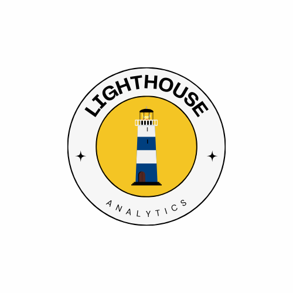
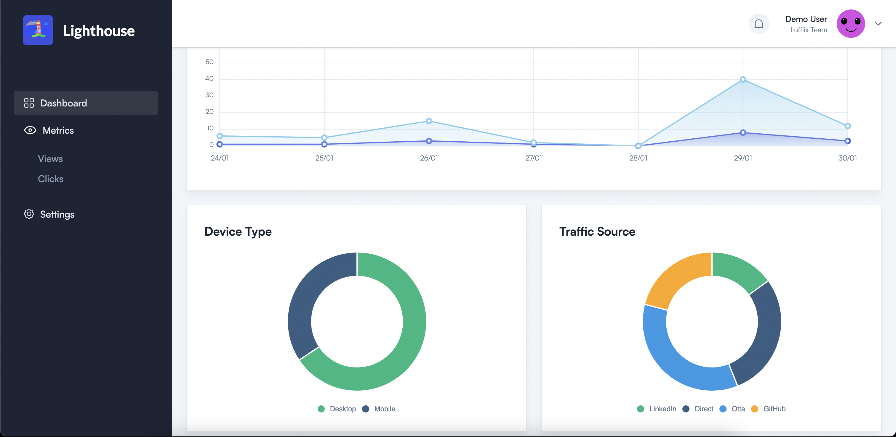

# Lighthouse

## Table of Contents

- [About](#about)
- [Example](#example)
- [Usage](#usage)
- [Roadmap](#usage)

## About

Real-time Web Analytics for website events. This project is setup to stream events through a kinesis stream into a DynamoDB table.

## Example

## Usage

1. add here

## Roadmap

- [ ] Add example screenshots to README
- [ ] Add Usage to README
